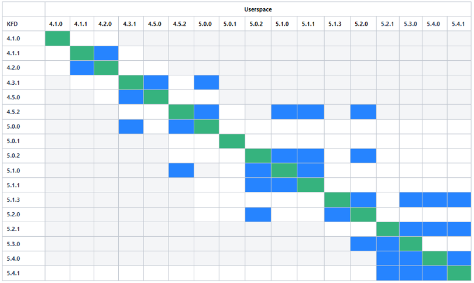

<table width="100%">
  <tr width="100%">
    <td align="center"><h1>Unified Inference Frontend (UIF) 1.1 User Guide </h1>
    </td>
 </tr>
 <tr>
 <td align="center"><h1>Step 1.0: Installation</h1>
 </td>
 </tr>
</table>


# Table of Contents

- [1.1: Pull PyTorch TensorFlow Docker (for GPU Users)](#11-pull-pytorchtensorflow-docker-for-gpu-users)
  - [1.1.1: Set up Host with ROCm/GPU](#111-set-up-host-with-rocmgpu)
  - [1.1.2: Install Docker](#112-install-docker)
  - [1.1.3: Pull a UIF Docker Image](#113-pull-a-uif-docker-image)
- [1.2: Pull PyTorch/TensorFlow Docker (for FPGA Users)](#12-pull-pytorchtensorflow-docker-for-fpga-users)
   - [1.2.1: Install Docker](#121-install-docker)  
   - [1.2.2: Pull a Vitis AI Docker Image](#122-pull-a-vitis-ai-docker-image)
 - [1.3: Install ZenDNN Package (for CPU Users)](#13-install-zendnn-package-for-cpu-users)
    - [1.3.1: TensorFlow+ZenDNN](#131-tensorflowzendnn)
    - [1.3.2: PyTorch+ZenDNN](#132-pytorchzendnn)
 - [1.4: Get the Inference Server Docker Image (for Model Serving)](#14-get-the-inference-server-docker-image-for-model-serving)
    - [1.4.1: Use a Prebuilt Docker Image](#141-use-a-prebuilt-docker-image)
    - [1.4.2: Build an Inference Server Docker Image](#142-build-an-inference-server-docker-image)


  _Click [here](/README.md#implementing-uif-11) to go back to the UIF User Guide home page._


# 1.1: Pull PyTorch/TensorFlow Docker (for GPU Users)

## 1.1.1: Set up Host with ROCm/GPU 

### ROCm Userspace and Kernel Driver Compatibility

ROCm™ Userspace API is guaranteed to be compatible with specific older and newer ROCm base driver installations. 

**Note**: The ROCm userspace is delivered using a Docker® container based on ROCm v5.4. Consult this matrix when running a Docker container with a different version of ROCm than installed on the host.

**Legend**

* Green: Shows compatibility between the same versions.

* Blue: Shows compatibility tested versions. 

* Gray: Not tested. 

**Note:** The color in the figures may vary slightly.



Kernel space compatibility meets the following condition:

* Userspace works with -/+ 2 releases of kernel space

### Framework Compatibility

The UIF v1.1 release supports the most recent and two prior releases of PyTorch and TensorFlow.

* UIF v1.1 is based on TensorFlow 2.10 and PyTorch 1.12.

* UIF v1.1 has been tested with TensorFlow 2.3 to 2.10 and PyTorch 1.2 to 1.12.

### ROCm Installation 

For general information on ROCm installation, refer to the [ROCm Installation Guide](https://docs.amd.com). 

### Verifying ROCm Installation

Verify the ROCm installation using the `rocminfo` command.

        $ /opt/rocm-<version>/bin/rocminfo


## 1.1.2: Install Docker

Install the Docker software. If Docker is not installed on your machine, see the [official Docker documentation](https://docs.docker.com/engine/install/) for installation instructions.

## 1.1.3: Pull a UIF Docker Image

The UIF/TensorFlow Docker image provides a superset functionality from ROCm/TensorFlow, and the UIF/PyTorch Docker image provides a superset functionality from ROCm/PyTorch.  When the UIF Docker images were created, no items were deleted from underlying PyTorch or TensorFlow Docker images. The items that have been added in the superset include:

* Quantizer and pruner tools as plugins to TensorFlow/PyTorch to enable the use of UIF Docker images to quantize models on a ROCm platform (for GPU or CPU). **Note:** To use the pruner, use the Vitis&trade; AI 3.0 ROCm Dockers. See the [Host Installation Instructions](https://xilinx.github.io/Vitis-AI/docs/install/install.html#docker-install-and-verification) in the Vitis AI documentation for details. 
* MIGraphX to enable the use of UIF Docker images for GPU inference

### PyTorch

A prebuilt Docker image is used to run UIF tools using PyTorch.

Follow these steps:

1.	Obtain the latest Docker image.

      		docker pull amdih/uif-pytorch:uif1.1_rocm5.4.1_vai3.0_py3.7_pytorch1.12


	The above instruction will download the UIF container, including PyTorch and optimization tools. 


2.	Start a Docker container using the image.

      		docker run -it --cap-add=SYS_PTRACE --security-opt seccomp=unconfined --device=/dev/kfd --device=/dev/dri --group-add video --ipc=host --shm-size 8G 	amdih/uif-pytorch:uif1.1_rocm5.4.1_vai3.0_py3.7_pytorch1.12

	You can also pass the `-v` argument to mount any data directories from the host onto the container.

### TensorFlow

A prebuilt Docker image is used to run UIF tools using TensorFlow.

Follow these steps:

1.	Obtain the latest Docker image.

      		docker pull amdih/uif-tensorflow:uif1.1_rocm5.4.1_vai3.0_tf2.10


	The above instruction will download the UIF container, including TensorFlow and optimization tools. 


2.	Start a Docker container using the image.

      		docker run -it --cap-add=SYS_PTRACE --security-opt seccomp=unconfined --device=/dev/kfd --device=/dev/dri --group-add video --ipc=host --shm-size 8G 	amdih/uif-tensorflow:uif1.1_rocm5.4.1_vai3.0_tf2.10

	You can also pass the `-v` argument to mount any data directories from the host onto the container.

# 1.2: Pull PyTorch/TensorFlow Docker (for FPGA Users)

## 1.2.1: Install Docker

Install the Docker software. If Docker is not installed on your machine yet, see the [official Docker documentation](https://docs.docker.com/engine/install/) for installation instructions.

## 1.2.2: Pull a Vitis AI Docker Image

For instuctions on how to pull a Docker image for the Vitis AI development environment, see the [Vitis AI Docker Installation](https://gitenterprise.xilinx.com/Vitis/vitis-ai-staging/blob/vai3.0_update/docs/docs/install/install.html).

# 1.3: Install ZenDNN Package (for CPU Users)

Perform the following steps to install TensorFlow and PyTorch built with ZenDNN:

### 1.3.1: TensorFlow+ZenDNN

To run inference on the TensorFlow model using ZenDNN, download and install the TensorFlow+ZenDNN package. Perform the following steps to complete the TensorFlow+ZenDNN installation:

1. Download the TensorFlow+ZenDNN v4.0 release package from the [AMD ZenDNN page](https://www.amd.com/en/developer/zendnn.html).

2. Unzip the package. For example: `TF_v2.10_ZenDNN_v4.0_Python_v3.8.zip`.

    ```
   unzip TF_v2.10_ZenDNN_v4.0_Python_v3.8.zip
    ```
3. Ensure that you have the conda environment installed, and execute the following commands:

    ```
    cd TF_v2.10_ZenDNN_v4.0_Python_v*/
    source scripts/TF_ZenDNN_setup_release.sh
    ```
TensorFlow+ZenDNN installation completes.

### 1.3.2: PyTorch+ZenDNN

To run inference on the PyTorch model using ZenDNN, download and install the PyTorch+ZenDNN package. Perform the following steps to complete the PyTorch+ZenDNN installation:

1. Download PTv1.12+ZenDNN_v4.0 release package from the [AMD ZenDNN page](https://www.amd.com/en/developer/zendnn.html).

2. Unzip the package. For example: `PT_v1.12.0_ZenDNN_v4.0_Python_v3.8.zip`.

    ```
    unzip PT_v1.12.0_ZenDNN_v4.0_Python_v3.8.zip
    ```
3. Ensure that you have the conda environment installed, and execute the following commands:

    ```
    cd PT_v1.12.0_ZenDNN_v4.0_Python_v*/ZenDNN/
    source scripts/PT_ZenDNN_setup_release.sh
    ```
    PyTorch+ZenDNN installation completes.

# 1.4: Get the Inference Server Docker Image (for Model Serving)

The AMD Inference Server is integrated with [ZenDNN](https://www.amd.com/en/developer/zendnn.html), [MIGraphX](https://github.com/ROCmSoftwarePlatform/AMDMIGraphX) and [Vitis AI](https://www.xilinx.com/products/design-tools/vitis/vitis-ai.html) and can be used for [model serving](/docs/4_deploy_your_own_model/serve_model/servingmodelwithinferenceserver.md). To use the inference server, you need a Docker image for it, which you can get by using a prebuilt image or building one from the [inference server repository](https://github.com/Xilinx/inference-server) on GitHub.

The instructions provided here are an overview, but you can see more complete information about the AMD Inference Server in the [documentation](https://xilinx.github.io/inference-server/0.3.0/index.html).

## 1.4.1: Use a Prebuilt Docker Image

You can pull the appropriate deployment Docker image(s) from DockerHub using:

```
docker pull amdih/serve:uif1.1_zendnn_amdinfer_0.3.0
docker pull amdih/serve:uif1.1_migraphx_amdinfer_0.3.0
```

The Vitis AI deployment image and development images for all platforms are not prebuilt and must be built by the user.

## 1.4.2: Build an Inference Server Docker Image

You need Docker (18.09+) to build the image.

1. Clone the `inference-server` repo.

```
git clone https://github.com/Xilinx/inference-server
cd inference-server
# version 0.3.0 corresponds to this documentation
git checkout v0.3.0
python3 docker/generate.py
./amdinfer dockerize <flags>
```

2. Use flags to control the image building, such as:

- `--production`: Builds the deployment version of the image instead of the default development one.
- `--vitis`: Enables FPGAs with Vitis AI in the image.
- `--migraphx`: Enables GPUs with MIGraphX in the image.
- `--tfzendnn=<path to zip>`: Enables CPUs with TF+ZenDNN in the image. You need to download [TF_v2.10_ZenDNN_v4.0_C++_API.zip](https://www.amd.com/en/developer/zendnn.html) and pass the path to it.
- `--ptzendnn=<path to zip>`: Enables CPUs with PT+ZenDNN in the image. You need to download [PT_v1.12_ZenDNN_v4.0_C++_API.zip](https://www.amd.com/en/developer/zendnn.html) and pass the path to it.

 **Note:** The downloaded ZenDNN package(s) must be inside the inference-server folder since the Docker will not be able to access files outside the repository.

You can pass these flags in any combination. Use `./amdinfer dockerize --help` for the full documentation on the available flags.

<hr/>

[< Previous](/README.md) | [Next >](/docs/2_model_setup/uifmodelsetup.md)

<hr/>

 # License

UIF is licensed under [Apache License Version 2.0](/LICENSE). Refer to the [LICENSE](/LICENSE) file for the full license text and copyright notice.

# Technical Support

Contact uif_support@amd.com for questions, issues, and feedback on UIF.

Submit your questions, feature requests, and bug reports on the [GitHub issues](https://github.com/amd/UIF/issues) page.

